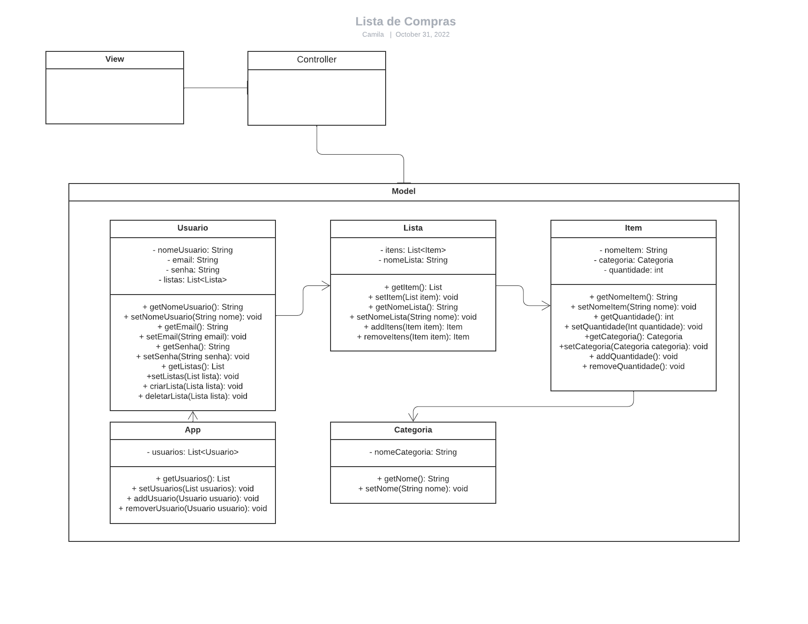
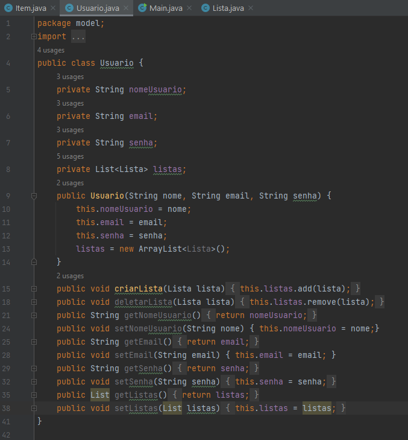
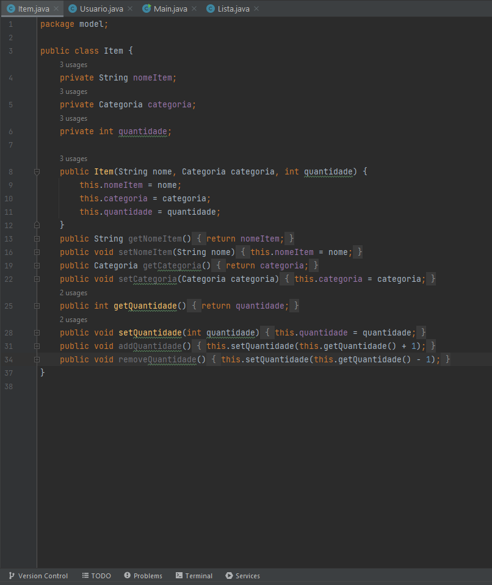

<h2>18/08/2022</h2>

"We see three critical differences between programming and software engineering: time, scale, and the trade-offs at play. On a software engineering project, engineers need to be more concerned with the passage of time and the eventual need for change. In a software engineering organization, we need to be more concerned about scale and efficiency, both for the software we produce as well as for the organization that is producing it. Finally, as software engineers, we are asked to make more complex decisions with higher-stakes outcomes, often based on imprecise estimates of time and growth.

Within Google, we sometimes say, “Software engineering is programming integrated over time.” Programming is certainly a significant part of software engineering: after all, programming is how you generate new software in the first place. If you accept this distinction, it also becomes clear that we might need to delineate between programming tasks (development) and software engineering tasks (development, modification, maintenance). The addition of time adds an important new dimension to programming. Cubes aren’t squares, distance isn’t velocity. Software engineering isn’t programming."

Titus Winters, Software Engineering at Google

 
<h3>>Comentários:</h3>

Um engenheiro de software também é um desenvolveldor de software. No entanto, um engenheiro de software possui funções extras como: ser responsável por gerenciar o tempo de suas tarefas, tomar de decisões a longo prazo e se preocupar com escalas e eficiencias de um software. Logo ser engenheiro de software é pensar em certos aspectos que vão além do código. Pensar nas possíbilidades futuras do projeto ou software, suas possiveis aplicações e usabilidade.

 
<h2>19/08/2022</h2>

Pergunta: O que é um trade-off no projeto da API do segundo semestre?
Resposta: Estipular o desenvolvimento de um software desktop não permite o cliente abrir o projeto em um navegador, além de não permitir seu uso no aparelho móvel. Porém, um software desktop permite uma flexibilidade de aplicação para o cliente.

 
<h2>25/08/2022</h2>

Sistema que simula uma lista de compras. Ele permite o usuário cadastrar um item que esta em falta e a sua respetiva quantidade em uma lista. Por fim, o usuário poderá compatilhar a lista com outra pessoa se necessário.

<h3>Requisitos Funcionais:</h3> 
Criar uma ou mais listas de compras, adicionar e remover itens das listas, alterar a quantidade de itens e compartilhar a lista.

 
<h3>Requisitos não funcionais:</h3>

	Usabilidade: interface simples e intuitiva de uso.
  	Integração: Sistema integra com outra aplicação.

 Arquitetura: MVC 

    
 
<h3>Diagrama de classes</h3>
 
    

  
<h3>Código do programa</h3>
  
<h2>Classe App</h2>
 
    
    
  
<h2>Classe Usuario</h2>
 
    
    
  
<h2>Classe Lista</h2>
 
    

  
<h2>Classe Item</h2>
 
    

  
<h2>Classe Categoria</h2>
 
    
 
  
<h2>Classe Main</h2>
 
    
    
  
<h2>Programa Rodando</h2>
 
    
